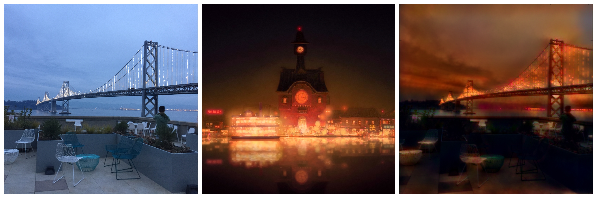
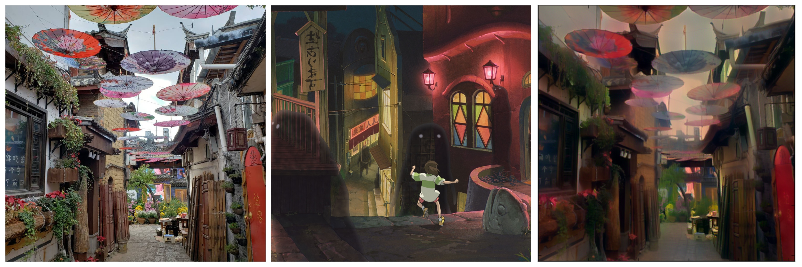
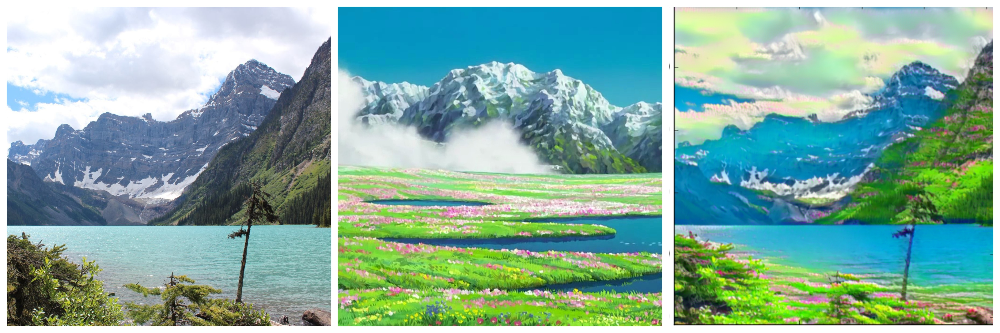
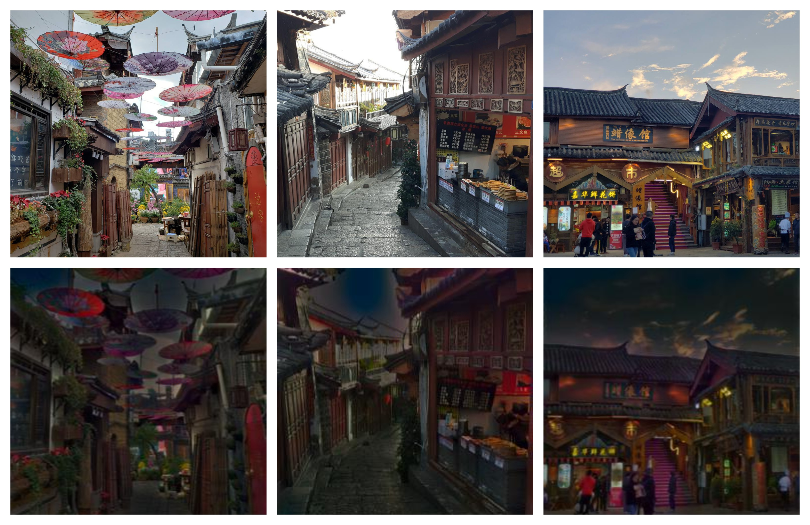

# MAIS202-Style-Transfer
This repository includes an original implementation and fast implementation of neural style transfer using Studio Ghibli images for the final project of MAIS202 administered by McGill Artificial Intelligence Society. 

## Original Style Transfer Implementation
This implementation follows [A Neural Algorithm of Artistic Style](https://arxiv.org/abs/1508.06576) by Gatys et al. (2015).

**iterate.py**: Edit `style_files = [ "./data/style/ghibli_square_4.png"]` and `content_files = [
  "./data/content/real_square_2_3.jpg"]` to include the path of the images you would like to stylize.
  
**style_transfer_methods.py**: Hyperparameters are set as follows:
```python
steps=300
s_weight = 1000000
c_weight = 1
```
(Note: **style_transfer_methods_mask.py** to implement Semantic Style Transfer is in progress)

Some sample results can be found in `data/results`; see `data/style` to see sample images and their respective file labels.





## Fast Style Transfer Implementation
This implementation follows [Perceptual Losses for Real-Time Style Transfer and Super-Resolution](https://arxiv.org/abs/1603.08155) by Johnson et al. (2016).

### Web App:
A Flask web app implementation is in progress; run **app.py** for an implementation of the image **ghibli_square_2.jpg** from Spirited Away.

### Train Your Own Model
Run **train.py** to train your own model; update `ghibliImg =1` to train for a different Ghibli style image. Download the COCO 2014 training dataset [here](http://cocodataset.org/#download) in the folder `./data`. Script is currently set to run for **epochs=2**, **content_weight = 500**, **style_weight = 1e7**.

Some sample results:

